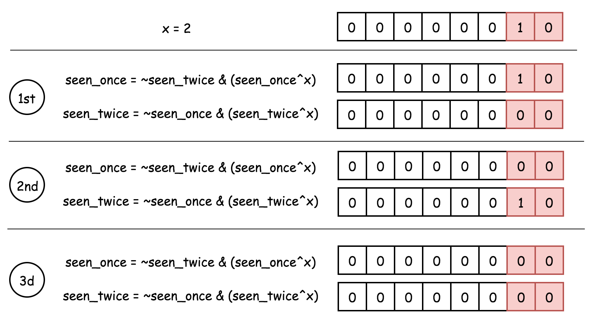
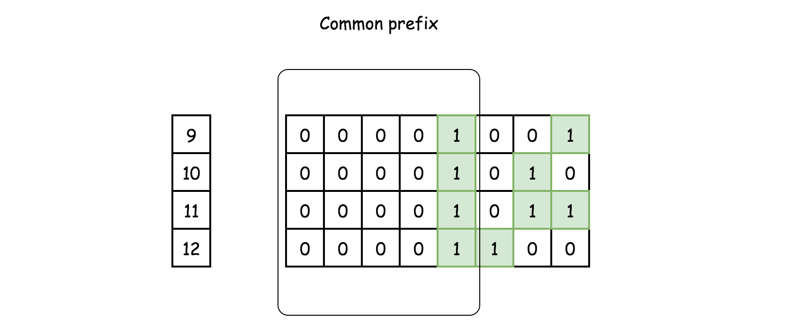

```java
1 XOR X = 1 - X
0 XOR X = X
(11111111111111)base2 = (-1)base0
(10000000000000)base2 = Integer.MIN_VALUE
```

### 136 Single Number

Given a non-empty array of integers `nums`, every element appears *twice* except for one. Find that single one.

You must implement a solution with a linear runtime complexity and use only constant extra space.

Example 1:

    Input: nums = [2,2,1]
    Output: 1

Example 2:

    Input: nums = [4,1,2,1,2]
    Output: 4

Example 3:

    Input: nums = [1]
    Output: 1

####Solution

A very classic XOR question!!

We should keep in mind that a XOR a = 0 !!!

```java
public int singleNumber(int[] nums) {
        int res = 0;
        for(int i = 0; i < nums.length; i ++)
            res ^= nums[i];
        return res;
  }
```

### 137 Single Number 2

Given an integer array `nums` where every element appears three times except for one, which appears exactly once. *Find the single element and return it*.

You must implement a solution with a linear runtime complexity and use only constant extra space.

Example 1:

    Input: nums = [2,2,3,2]
    Output: 3

Example 2:

    Input: nums = [0,1,0,1,0,1,99]
    Output: 99

#### Solution1 - HashMap

#### HashSet

The idea is to convert an input array into hashset and then to compare the tripled sum of the set with the array sum

3 \\times (a + b + c) - (a + a + a + b + b + b + c) = 2 c3×(a+b+c)−(a+a+a+b+b+b+c)=2c

```java
class Solution {
  public int singleNumber(int[] nums) {
    Set<Long> set = new HashSet<>();
    long sumSet = 0, sumArray = 0;
    for(int n : nums) {
      sumArray += n;
      set.add((long)n);
    }
    for(Long s : set) sumSet += s;
    return (int)((3 * sumSet - sumArray) / 2);
  }
}
```

\#\#\#\# Solution 2 -

#### Bitwise Operators : NOT, AND and XOR

This is premium version of \#136.

We know that one could see the bit in a bitmask only if it appears odd number of times.

Since :

XOR of zero and a bit results in that bit

0 \\oplus x = x0⊕x=x

XOR of two equal bits (even if they are zeros) results in a zero

x \\oplus x = 0x⊕x=0

AND and NOT

To separate number that appears once from a number that appears three times let's use two bitmasks instead of one: `seen_once` and `seen_twice`.

The idea is to

* change `seen_once` only if `seen_twice` is unchanged
* change `seen_twice` only if `seen_once` is unchanged

  

```java
public int singleNumber(int[] nums) {
    int seenOnce = 0, seenTwice = 0;

    for (int num : nums) {
      // first appearence: 
      // add num to seen_once 
      // don't add to seen_twice because of presence in seen_once

      // second appearance: 
      // remove num from seen_once 
      // add num to seen_twice

      // third appearance: 
      // don't add to seen_once because of presence in seen_twice
      // remove num from seen_twice
      seenOnce = ~seenTwice & (seenOnce ^ num);
      seenTwice = ~seenOnce & (seenTwice ^ num);
    }

    return seenOnce;
  }
```


### 67 Add Binary

Given two binarA strings `a` and `b`, return *their sum as a binary string*.

Example 1:

    Input: a = "11", b = "1"
    Output: "100"

Example 2:

    Input: a = "1010", b = "1011"
    Output: "10101"

```java
class Solution {
  public String addBinary(String a, String b) {
    return Integer.toBinaryString(Integer.parseInt(a, 2) + Integer.parseInt(b, 2));
  }
}
```

### Q2 78-Subsets

Given an integer array `nums` of unique elements, return *all possible subsets (the power set)*.

The solution set must not contain duplicate subsets. Return the solution in any order.

Example 1:

    Input: nums = [1,2,3]
    Output: [[],[1],[2],[1,2],[3],[1,3],[2,3],[1,2,3]]

Example 2:

    Input: nums = [0]
    Output: [[],[0]]

Solution:

We can used bit manipulation to solve this problem!

Since each digit have two state: 1 - present, 0 - absent

```java
public List<List<Integer>> subsets(int[] nums) {
        List<List<Integer>> subsets = new ArrayList<>();
        int n = nums.length;
        for(int i = 0; i < (1 << n); i ++){
            List<Integer> currentSubSet = new ArrayList<>();
            int bitmask = 1;
            for(int j = 0; j < n; j ++){
                if((bitmask & i) != 0)
                    currentSubSet.add(nums[j]);
                bitmask = bitmask << 1; 
            }
            subsets.add(currentSubSet);
        }
        return subsets;
    }
```

### 190 Reverse Bits

Example 1:

    Input: n = 00000010100101000001111010011100
    Output:    964176192 (00111001011110000010100101000000)
    Explanation: The input binary string 00000010100101000001111010011100 represents the unsigned integer 43261596, so return 964176192 which its binary representation is 00111001011110000010100101000000.

```java
 public int reverseBits(int n) {
        int bitmask = 1;
        int res = 0;
        while(bitmask != 0){
            res = (bitmask & n) == 0 ? res << 1 : (res << 1) + 1;
            bitmask = bitmask << 1;
        }
        return res;
    }
```

### 191 Number of 1 Bits

Write a function that takes an unsigned integer and returns the number of '1' bits it has (also known as the [Hamming weight](http://en.wikipedia.org/wiki/Hamming_weight)).

Example 1:

    Input: n = 00000000000000000000000000001011
    Output: 3
    Explanation: The input binary string 00000000000000000000000000001011 has a total of three '1' bits.

Example 2:

    Input: n = 00000000000000000000000010000000
    Output: 1
    Explanation: The input binary string 00000000000000000000000010000000 has a total of one '1' bit.

#### Solution1 : Normal one - Loop

```java
public int hammingWeight(int n) {
        int bitmask = 1;
        int count = 0;
        for(int i = 0; i < 32; i ++)
            if(((bitmask << i) & n) != 0)
                count ++;
        return count;
    }
```

We can make the previous algorithm simpler and a little faster. Instead of checking every bit of the number, we repeatedly flip the least-significant 11-bit of the number to 00, and add 11 to the sum. As soon as the number becomes 00, we know that it does not have any more 11-bits, and we return the sum.

The key idea here is to realize that for any number nn, doing a bit-wise AND of nn and n - 1n−1 flips the least-significant 11-bit in nn to 00. Why? Consider the binary representations of nn and n - 1n−1.

```java
public int hammingWeight(int n) {
    int sum = 0;
    while (n != 0) {
        sum++;
        n &= (n - 1);
    }
    return sum;
}
```

### 1009 Complement of Base 10 Integer

The complement of an integer is the integer you get when you flip all the `0`'s to `1`'s and all the `1`'s to `0`'s in its binary representation.

* For example, The integer `5` is `"101"` in binary and its complement is `"010"` which is the integer `2`.

Given an integer `n`, return *its complement*.

Example 1:

    Input: n = 5
    Output: 2
    Explanation: 5 is "101" in binary, with complement "010" in binary, which is 2 in base-10.

Example 2:

    Input: n = 7
    Output: 0
    Explanation: 7 is "111" in binary, with complement "000" in binary, which is 0 in base-10.

#### Solution1

#### Prerequisites

XOR

[XOR](https://en.wikipedia.org/wiki/Exclusive_or) of zero and a bit results in that bit

0 \\oplus x = x0⊕x=x

> XOR of one and a bit flips that bit

1 \\oplus x = 1 - x1⊕x=1−x

What i want to do is

1\. Set one to every bit locates left for the leftmost 1s of n, let us call it comp : (3)base2 = (11), comp -\> (111111100)

2\. -n ^ comp - 1; 

We need to care 0! It’s a edge case ! Since (111111111) - 1 = -1 - 1 = - 2

```java
public int bitwiseComplement(int n) {
        if(n == 0)
            return 1;
        int comp = -1;
        while((comp & n) != 0)
            comp = comp << 1;
        int res = (comp ^ (- n)) - 1;
        return res; 
    }
```

#### Solution 2 - Built-in Functions to Construct 1-bits Bitmask

Approach 2 could be rewritten with the help of built-in functions: `bit_length` in Python and `highestOneBit` in Java. The first one is trivial, and `Integer.highestOneBit(int x)` method in Java returns int with leftmost bit set in x, i.e. `Integer.highestOneBit(3) = 2`.

```java
class Solution {
  public int bitwiseComplement(int N) {
    return N == 0 ? 1 : (Integer.highestOneBit(N) << 1) - N - 1;
  }
}
```

### 29. Divide Two Integers

Given two integers `dividend` and `divisor`, divide two integers without using multiplication, division, and mod operator.

Note: Assume we are dealing with an environment that could only store integers within the 32-bit signed integer range: `[−231, 231 − 1]`. For this problem, assume that your function returns `231 − 1` when the division result overflows.

#### Solution

* While you might be tempted to use multiplication and division for a few "simple" tasks, this is unnecessary. Here are some alternatives:
  * Instead of `a = a * -1` for making numbers negative, use `a = -a`.
  * Instead of using `a / 2` for dividing by `2`, use the right shift operator; `a >> 1`.
  * Instead of using `a * 2` for doubling, use `a = a + a`, `a += a`, or even the left shift operator; `a << 1`.

Why we need to use negative number? since negative number have larger range !

```java
private static int HALF_INT_MIN = -1073741824;

public int divide(int dividend, int divisor) {

    // Special case: overflow.
    if (dividend == Integer.MIN_VALUE && divisor == -1) {
        return Integer.MAX_VALUE;
    }

    /* We need to convert both numbers to negatives.
     * Also, we count the number of negatives signs. */
    int negatives = 2;
    if (dividend > 0) {
        negatives--;
        dividend = -dividend;
    }
    if (divisor > 0) {
        negatives--;
        divisor = -divisor;
    }

    int quotient = 0;
    /* Once the divisor is bigger than the current dividend,
     * we can't fit any more copies of the divisor into it. */
    while (divisor >= dividend) {
        /* We know it'll fit at least once as divivend >= divisor.
         * Note: We use a negative powerOfTwo as it's possible we might have
         * the case divide(INT_MIN, -1). */
        int powerOfTwo = -1;
        int value = divisor;
        /* Check if double the current value is too big. If not, continue doubling.
         * If it is too big, stop doubling and continue with the next step */
        while (value >= HALF_INT_MIN && value + value >= dividend) {
            value += value;
            powerOfTwo += powerOfTwo;
        }
        // We have been able to subtract divisor another powerOfTwo times.
        quotient += powerOfTwo;
        // Remove value so far so that we can continue the process with remainder.
        dividend -= value;
    }

    /* If there was originally one negative sign, then
     * the quotient remains negative. Otherwise, switch
     * it to positive. */
    if (negatives != 1) {
        return -quotient;
    }
    return quotient;
}
```

Complexity Analysis

Let nn be the absolute value of dividenddividend.

* Time Complexity : O(\\log \\, n)O(logn).

  Same as Approach 3, except instead of looping over a generated array, we simply perform an O(1)O(1) halving operation to get the next values we need.
* Space Complexity : O(1)O(1).

  We only use a fixed number of integer variables, so the space complexity is O(1)O(1).

### 201. Bitwise AND of Numbers Range

Given two integers `left` and `right` that represent the range `[left, right]`, return *the bitwise AND of all numbers in this range, inclusive*.

Example 1:

    Input: left = 5, right = 7
    Output: 4

Example 2:

    Input: left = 0, right = 0
    Output: 0

Example 3:

    Input: left = 1, right = 2147483647
    Output: 0

#### Solution

We cannot iterate every number from m to n !!!



In the above example, one might notice that after the AND operation on all the numbers, the remaining part of bit strings is the *common prefix* of all these bit strings.

The final result asked by the problem consists of this common prefix of bit string as its left part, with the rest of bits as zeros.

More specifically, the *common prefix* of all these bit string is also the common prefix between the *starting* and *ending* numbers of the specified range (*i.e.* 9 and 12 respectively in the above example).

> As a result, we then can reformulate the problem as *"given two integer numbers, we are asked to find the *common prefix* of their binary strings."*
> 
> *
> *

Given the above intuition about the problem, our task is to calculate the *common prefix* for the bit strings of the two given numbers. One of the solutions would be to resort to the *bit shift* operation.

> The idea is that we shift both numbers to the right, until the numbers become equal, *i.e.* the numbers are reduced into their common prefix. Then we append zeros to the common prefix in order to obtain the desired result, by shifting the common prefix to the left.


```java
public int rangeBitwiseAnd(int m, int n) {
    int shift = 0;
    // find the common 1-bits
    while (m < n) {
      m >>= 1;
      n >>= 1;
      ++shift;
    }
    return m << shift;
  }
```

#### Brian Kernighan's Algorithm

Speaking of bit shifting, there is another related algorithm called [Brian Kernighan's algorithm](http://graphics.stanford.edu/~seander/bithacks.html#CountBitsSetKernighan) which is applied to turn off the rightmost bit of one in a number.

The secret sauce of the *Brian Kernighan's algorithm* can be summarized as follows:

> When we do AND bit operation between `number` and `number-1`, the rightmost bit of one in the original `number` would be turned off (from one to zero).


> The idea is that for a given range [m, n][m,n] (*i.e.* m \< nm\<n), we could iteratively apply the trick on the number nn to *turn off* its rightmost bit of one until it becomes less or equal than the beginning of the range (mm), which we denote as n'n′. Finally, we do AND operation between n'n′ and mm to obtain the final result.

By applying the Brian Kernighan's algorithm, we basically turn off the bits that lies on the right side of the *common prefix*, from the ending number nn. With the rest of bits reset, we then can easily obtain the desired result.

```java
public int rangeBitwiseAnd(int m, int n) {
    while (m < n) {
      // turn off rightmost 1-bit
      n = n & (n - 1);
    }
    return m & n;
}
```

### 231. Power of Two

Given an integer `n`, return *`true` if it is a power of two. Otherwise, return `false`*.

An integer `n` is a power of two, if there exists an integer `x` such that `n == 2x`.

#### Solution1  Get the Rightmost 1-bit

let's do `x & (-x)` to keep the rightmost 1-bit and to set all the others bits to zero. As discussed above, for the power of two it would result in `x` itself, since a power of two contains just one 1-bit.

Other numbers have more than 1-bit in their binary representation and hence for them `x & (-x)` would not be equal to `x` itself.

Hence a number is a power of two if `x & (-x) == x`.

```java
public boolean isPowerOfTwo(int n) {
    if (n == 0) return false;
    long x = (long) n;
    return (x & (-x)) == x;
  }
```

#### Solution 2

Turn off the Rightmost 1-bit

Let's first discuss why `x & (x - 1)` is a way to set the rightmost 1-bit to zero.

To subtract 1 means to change the rightmost 1-bit to 0 and to set all the lower bits to 1.

Now AND operator: the rightmost 1-bit will be turned off because `1 & 0 = 0`, and all the lower bits as well.

Detect Power of Two

The solution is straightforward:

1. Power of two has just one 1-bit.
2. `x & (x - 1)` sets this 1-bit to zero, and hence one has to verify if the result is zero `x & (x - 1) == 0`.

```java
class Solution {
  public boolean isPowerOfTwo(int n) {
    if (n == 0) return false;
    long x = (long) n;
    return (x & (x - 1)) == 0;
  }
}
```

### 342. Power of Four

Given an integer `n`, return *`true` if it is a power of four. Otherwise, return `false`*.

An integer `n` is a power of four, if there exists an integer `x` such that `n == 4x`.

#### Solution1

Check if it is 2^x and check root \* root ?= n and n \> 0

```java
 public boolean isPowerOfFour(int n) {
        if(n <= 0)
            return false;
        int root = (int)Math.sqrt(n);
        return root * root == n && (n & (n-1)) == 0;
    }
```

#### Solution2: Learn Hexadecimal

Let's first check if num is a power of two: `x > 0 and x & (x - 1) == 0`.

Now the problem is to distinguish between even powers of two (when xx is a power of four) and odd powers of two (when xx is *not* a power of four). In binary representation both cases are single 1-bit followed by zeros.

> What is the difference? In the first case (power of four), 1-bit is at even position: bit 0, bit 2, bit 4, etc. In the second case, at odd position.


Hence power of four would make a zero in a bitwise AND with number (101010...10)\_2(101010...10)2​:

4^a \\land (101010...10)\_2 == 04a∧(101010...10)2​==0

> How long should be (101010...10)\_2(101010...10)2​ if xx is a signed integer? 32 bits. To write shorter, in 8 charaters instead of 32, it's common to use [hexadecimal](https://en.wikipedia.org/wiki/Hexadecimal) representation: (101010...10)\_2 = (aaaaaaaa)\_{16}(101010...10)2​=(aaaaaaaa)16​.

x \\land (aaaaaaaa)\_{16} == 0x∧(aaaaaaaa)16​==0

```java
public boolean isPowerOfFour(int num) {
    return (num > 0) && ((num & (num - 1)) == 0) && ((num & 0xaaaaaaaa) == 0);
  }
```

### 320. Generalized Abbreviation

A word's generalized abbreviation can be constructed by taking any number of non-overlapping substrings and replacing them with their respective lengths. For example, `"abcde"` can be abbreviated into `"a3e"` (`"bcd"` turned into `"3"`), `"1bcd1"` (`"a"` and `"e"` both turned into `"1"`), and `"23"` (`"ab"` turned into `"2"` and `"cde"` turned into `"3"`).

Given a string `word`, return *a list of all the possible generalized abbreviations of* `word`. Return the answer in any order.

Example 1:

    Input: word = "word"
    Output: ["4","3d","2r1","2rd","1o2","1o1d","1or1","1ord","w3","w2d","w1r1","w1rd","wo2","wo1d","wor1","word"]

Example 2:

    Input: word = "a"
    Output: ["1","a"]

#### Solution - Bit Manipulation

Intuition

If we use 00 to represent a character that is not abbreviated and 11 to represent one that is. Then each abbreviation is mapped to an nn bit binary number and vice versa.

Algorithm

To generate all the 2^n2n abbreviation with non-repetition and non-omission, we need to follow rules. In approach \#1, the rules are coded in the backtracking process. Here we introduce another way.

From the intuition section, each abbreviation has a one to one relationship to a nn bit binary number xx. We can use these numbers as blueprints to build the corresponding abbreviations.

For example:

Given word = `"word"` and x = `0b0011`

Which means `'w'` and `'o'` are kept, `'r'` and `'d'` are abbreviated. Therefore, the result is "wo2".

Thus, for a number xx, we just need to scan it bit by bit as if it is an array so that we know which character should be kept and which should be abbreviated.

To scan a number xx bit by bit, one could extract its last bit by `b = x & 1` and shift xx one bit to the right, i.e. `x >>= 1`. Doing this repeatedly, one will get all the nn bits of xx from last bit to first bit.

```java
public List<String> generateAbbreviations(String word) {
        List<String> ans = new ArrayList<>();
        for (int x = 0; x < (1 << word.length()); ++x) // loop through all possible x
            ans.add(abbr(word, x));
        return ans;
    }

    // build the abbreviation for word from number x
    private String abbr(String word, int x) {
        StringBuilder builder = new StringBuilder();
        int k = 0, n = word.length(); // k is the count of consecutive ones in x
        for (int i = 0; i < n; ++i, x >>= 1) {
            if ((x & 1) == 0) { // bit is zero, we keep word.charAt(i)
                if (k != 0) { // we have abbreviated k characters
                    builder.append(k);
                    k = 0; // reset the counter k
                }
                builder.append(word.charAt(i));
            }
            else // bit is one, increase k
                ++k;
        }
        if (k != 0) builder.append(k); //don't forget to append the last k if non zero
        return builder.toString();
    }
```

\*\*Complexity Analysis\*\*

* Time complexity : O(n 2^n)O(n2n). Building one abbreviation from the number xx, we need scan all the nn bits. Besides the `StringBuilder::toString` function is also linear. Thus, to generate all the 2^n2n, it costs O(n 2^n)O(n2n) time.
* Space complexity : O(n)O(n). If the return list doesn't count, we only need O(n)O(n) auxiliary space to store the characters in `StringBuilder.`

### 338. Counting Bits

Given an integer `n`, return *an array *`ans`* of length *`n + 1`* such that for each *`i`* *(`0 <= i <= n`)*, *`ans[i]`* is the number of *`1`*'s in the binary representation of *`i`.

Example 1:

    Input: n = 2
    Output: [0,1,1]
    Explanation:
    0 --> 0
    1 --> 1
    2 --> 10

Example 2:

    Input: n = 5
    Output: [0,1,1,2,1,2]
    Explanation:
    0 --> 0
    1 --> 1
    2 --> 10
    3 --> 11
    4 --> 100
    5 --> 101

### Solution: DP + Most Significant Bit

Intuition

Use previous count results to generate the count for a new integer.

Algorithm

Suppose we have an integer:

x = (1001011101)\_2 = (605)\_{10}x=(1001011101)2​=(605)10​

and we already calculated and stored all the results of 00 to x - 1x−1.

Then we know that xx is differ by one bit with a number we already calculated:

x' = (1011101)\_2 = (93)\_{10}x′=(1011101)2​=(93)10​

They are different only in the most significant bit.

Let's exam the range [0, 3][0,3] in the binary form:

(0) = (0)\_2(0)=(0)2​

(1) = (1)\_2(1)=(1)2​

(2) = (10)\_2(2)=(10)2​

(3) = (11)\_2(3)=(11)2​

One can see that the binary form of 2 and 3 can be generated by adding 1 bit in front of 0 and 1\. Thus, they are different only by 1 regarding pop count.

Similarly, we can generate the results for [4, 7][4,7] using [0, 3][0,3] as blueprints.

In general, we have the following transition function for popcount P(x)P(x):

P(x + b) = P(x) + 1, b = 2^m \> xP(x+b)=P(x)+1,b=2m\>x

With this transition function, we can then apply Dynamic Programming to generate all the pop counts starting from 00.

```java
public int[] countBits(int n) {
        int[] ans = new int[n + 1];
        int x = 0;
        int b = 1;
    
        // [0, b) is calculated
        while (b <= n) {
            // generate [b, 2b) or [b, n) from [0, b)
            while (x < b && x + b <= n) {
                ans[x + b] = ans[x] + 1;
                ++x;
            }                         
            x = 0; // reset x
            b <<= 1; // b = 2b
        }        
        return ans; 
    }
```

